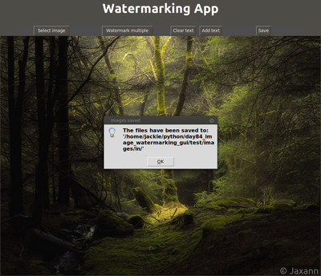

## Image Watermarking Desktop App

A desktop application where you can choose an image and add some text as a watermark to it.

You can also select a folder of images and add a watermark text to all images in the folder.

